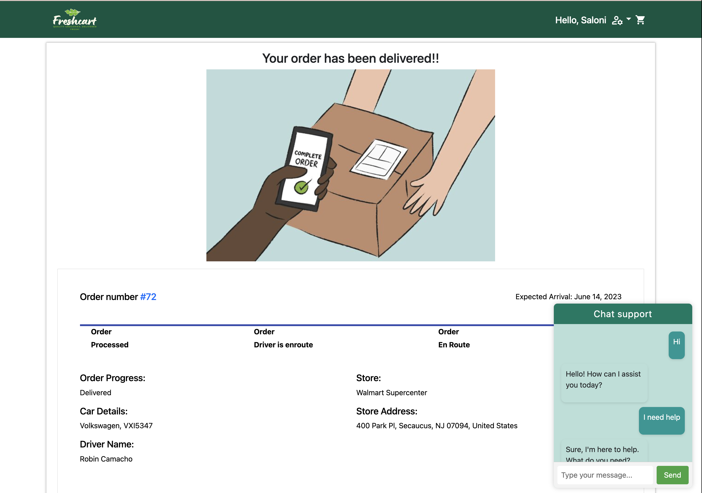

# 

Summary

## Table of Contents🐛

- [Demo](https://youtu.be/5FRoU_AbYI0)
- [Tech Stack](#tech-stack)
- [Features](#features)
- [Setup/Installation](#installation)
- [To-Do](#future)

## <a name="tech-stack"></a>Tech Stack

**Frontend:** React, Redux, Javascript, Bootstrap, CSS, HTML5, MaterialUI <br/>
**Backend:** Python, Flask, PostgreSQL, SQLAlchemy <br/>
**APIs:** Stripe API, Google maps API, Spooncular API, <br/>
**Other Libraries:** flask_socketio, react-stripe-js, socket.io-client, react-redux, flask-caching, NLTK, react-google-maps, react-bootstrap, react-icons

## <a name="features"></a>Features 📽


<br/><br/><br/>
People can Browse the website as a guest, add items to cart


<br/><br/><br/>
In order to checkout, user has to create an account, which then will move items from guest cart to user cart


<br/><br/><br/>
Checkout payment will be handled by Stripe Payment intent


<br/><br/><br/>
Customer will be connected to the nearest driver to them, that will deliver the groceries to them, live updates will happen using websockets




<br/><br/><br/>
Can interact with the chatbot or speak to representative as well, real time communication will happen using websockets


<br/><br/><br/>
user can see their previous orders

## <a name="installation"></a>Setup/Installation ⌨️

#### Requirements:

- PostgreSQL
- Python 3.8
- Google Maps, Stripe API and Spooncular API keys

To have this app running on your local computer, please follow the below steps:

Clone repository:

```
$ git clone (link)
```

Create a virtual environment🔮:

```
$ virtualenv env
```

Activate the virtual environment:

```
$ source env/bin/activate
```

Install dependencies🔗:

```
$ pip install -r requirements.txt
```

Get your own secret keys🔑 for [Google](https://console.cloud.google.com) and [Stripe](https://dashboard.stripe.com/). Save them to a file `secrets.sh`. Your file should look something like this:

```
export API_KEY='abc'
export STRIPE_API_KEY='abc'
export GOOGLE_API_KEY='abc'
```

Create database 'freshcart'.

```
$ createdb freshcart
```

Create your database tables and seed example data.

```
$ python model.py
```

Run the app from the command line.

```
$ python server.py
```

If you want to use SQLAlchemy to query the database, run in interactive mode

```
$ python -i model.py
```
